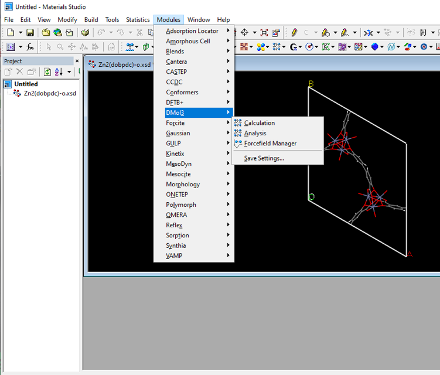
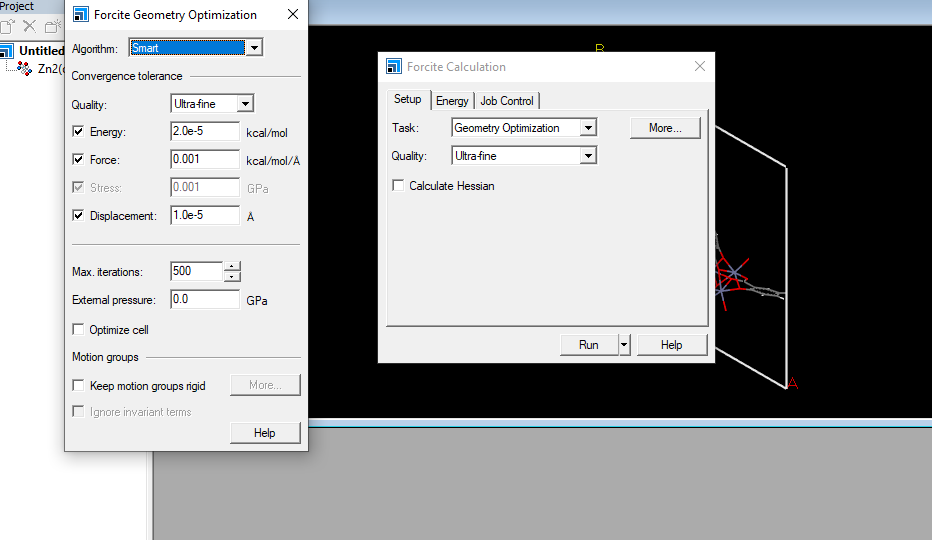
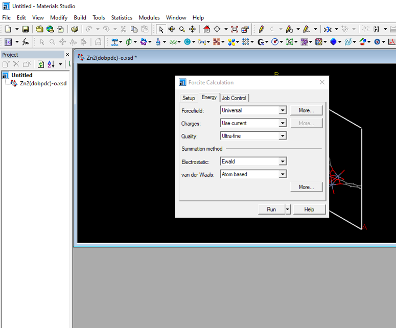
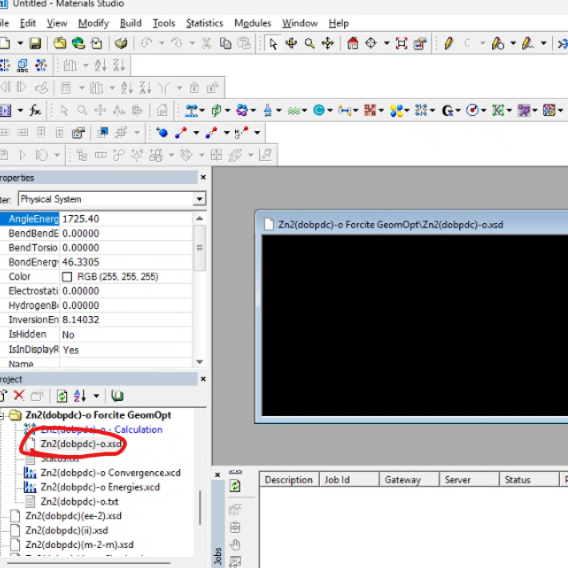

+++
date = '2026-03-13T18:13:52+08:00'
draft = false
title = '关于raspa2模拟流程示例'
slug = 'myfirst_blog'
+++


## 1.结构优化（geo_opt）
以MS的forcite模块为例进行结构优化

打开MS并导入cif文件
点击MS菜单选择【Modules】——【forcite】——【calculation】

将【task】选项改为Geometry optimization（点击more即可打开左边的窗口）
在【setup】选择合适的精度（我这里选取Smart, Ultra-fine的精度）

在【energy】选项中，力场（forcefiled）选择universal，质量（quality）选择ultra-fine

点击【run】
产生结构优化文件
选择文件夹中.xsd后缀的文件

点击【file】——【export】（格式选择为cif格式)
至此，我们获得了结构优化后的cif文件。
## 2.进行氦气孔隙率模拟
编辑raspa input文件（以下为示例文件）

运行文件相对位置
```text
RASPA_Simulation/
├── simulation.input               
├── force_field_mixing_rules.def  
├── helium.def
├── pseudo_atoms.def               
├── Zn2(dobpdc)-o.cif                                             
```

simulation.input
```text
SimulationType                MonteCarlo
NumberOfCycles                30000
NumberOfInitializationCycles  3000
PrintEvery                    1000
RestartFile                   no

Forcefield                    local
UseChargesFromCIFFile         yes  
CutOff                        10.5

Framework                     0
FrameworkName                 Zn2(dobpdc)-0  #此处更改为需要进行模拟cif文件名
UnitCells                     1 1 4    
ExternalTemperature           298.0

Component 0 MoleculeName      helium
MoleculeDefinition            local
WidomProbability              1.0
CreateNumberOfMolecules       0
```
进行模拟

模拟完成后会产生以下文件，
```text
RASPA_Simulation/
├── simulation.input              
├── force_field_mixing_rules.def 
├── helium.def  
├── pseudo_atoms.def              
├── Zn2(dobpdc)-o.cif                 
├── Movies/ 
├── Output/
├── Restrat/                              
└── VTK/                                  #用来进行可视化的（可有可无）
```

使用9950x的单核模拟，消耗时间约为3mins

打开【output】——【system0】——output文件
查找`Average Widom Rosenbluth-weigh`
示例：
`	[helium] Average Widom Rosenbluth-weight:   0.249963 +/- 0.000741 [-]`
(0.249963为氦气孔隙率，0.000741为误差)

准备工作完成后，可以进行正式的气体模拟。
## 3.气体吸附模拟

与氦气孔隙率的模拟类似，只是把氦气替换为你所需要吸附的气体
这里以CO2为例

```text
RASPA_Simulation/
├── simulation.input               
├── force_field_mixing_rules.def  
├── CO2.def
├── pseudo_atoms.def               
├── Zn2(dobpdc)-o.cif                                             
```


simulation.input文件示例：
```text
SimulationType                       MonteCarlo
NumberOfCycles                       1000000
NumberOfInitializationCycles         1000000
PrintEvery                           1000

Forcefield                           local    
UseChargesFromCIFFile                yes      
ChargeMethod                         Ewald
CutOff                               12       

Framework 0
FrameworkName                        Zn2(dobpdc)-o
UnitCells                            2 2 4
HeliumVoidFraction                   0.249963      #此处填写氦气孔隙率的模拟结果
ExternalTemperature                  298      
ExternalPressure                     100000    

ComputeDensityProfile3DVTKGrid       yes      
WriteDensityProfile3DVTKGridEvery    100000
DensityProfile3DVTKGridPoints        150 150 150 
AverageDensityOverUnitCellsVTK       yes      
DensityAveragingTypeVTK              FullBox

Component 0 MoleculeName             CO2
            MoleculeDefinition       local
            IdealGasRosenbluthWeight 1.0
            TranslationProbability   1.0
            RotationProbability      1.0
            ReinsertionProbability   1.0
            SwapProbability          2.0
            CreateNumberOfMolecules  0
```

*raspa网站 （[RASPA – iRASPA](https://iraspa.org/raspa/)）
具体参数设置及学习可以参照raspa2的手册（[raspa manual](https://iraspa.org/raspa/#)）

模拟完成后产生以下文件


```text
RASPA_Simulation/
├── simulation.input
├── CO2.def              
├── force_field_mixing_rules.def   
├── pseudo_atoms.def              
├── Zn2(dobpdc)-o.cif                 
├── Movies/ 
├── Output/
├── Restrat/                              
└── VTK/                                  #用来进行可视化的（可有可无）
```

使用9950x的单核模拟消耗约24h

之后可以在【output】——【system0】——output文件   寻找感兴趣的结果
